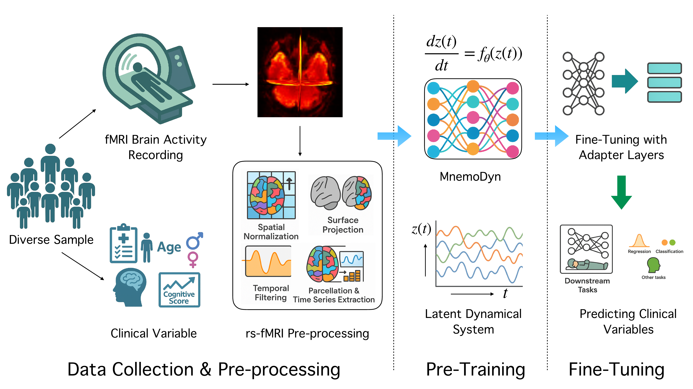

# MnemoDyn: Learning Resting State Dynamics from 40K FMRI sequences

[[Paper]]() [[Poster]]() [[Slide]]()

### Sourav Pal , Viet Luong, Hoseok Lee, Tingting Dan, Guorong Wu, Richard Davidson, Won Hwa Kim, Vikas Singh



Implementation repository for **MnemoDyn** (ICLR 2026): an operator-learning foundation model for resting-state fMRI based on multi-resolution wavelet dynamics and CDE-style temporal modeling.


## What This Repo Contains

- Pretraining code for MnemoDyn / ORion-style backbones:
  - `coe/light/model/main.py`
  - `coe/light/model/main_masked_autoencode.py`
  - `coe/light/model/main_masked_autoencode_jepa.py`
  - `coe/light/model/main_denoise.py`
  - `coe/light/model/orion.py`
- Core model components:
  - `coe/light/model/conv1d_optimize.py`
  - `coe/light/model/dense_layer.py`
  - `coe/light/model/ema.py`
  - `coe/light/model/normalizer.py`
- Downstream fine-tuning / evaluation scripts for multiple datasets:
  - HBN, ADHD200, ADNI, ABIDE, NKIR, UK Biobank, HCP Aging under `coe/light/*.py`
- Shell launch scripts:
  - `coe/light/script/*.sh`
- Dependency snapshot:
  - `highdim_req.txt`

## Repository Layout

```text
.
├── highdim_req.txt
├── pyproject.toml
├── coe/
│   ├── parcellation/
│   └── light/
│       ├── model/
│       ├── script/
│       ├── *_dataset.py
│       └── *classification*.py, *regress*.py
└── README.md
```

## Environment Setup

Python 3.10+ is recommended.

### Option A (recommended): `uv`

This repo includes a `pyproject.toml` generated from `highdim_req.txt`.

```bash
uv venv
source .venv/bin/activate
uv sync
```

### Option B: `pip` + requirements file

```bash
python -m venv .venv
source .venv/bin/activate
pip install -r highdim_req.txt
```

Ensure GPU-enabled PyTorch is correctly installed for your CUDA version (the pinned stack is CUDA-12 oriented).

## Data Expectations

Most training/evaluation scripts expect:
- preprocessed/parcellated rs-fMRI files (`*.dtseries.nii`)
- dataset-specific CSV/TSV metadata (labels, demographics, subject IDs)
- local absolute paths under `/mnt/...` (as currently hardcoded in many scripts)

Examples in current code:
- `/mnt/sourav/HBN_dtseries/`
- `/mnt/sourav/ADHD200_dtseries/`
- `/mnt/vhluong/...csv`

You will likely need to edit dataset paths inside scripts before running on a new machine.

## Quick Start

### 1) Pretrain (masked autoencoding)

From `coe/light/model/`:

```bash
cd coe/light/model
bash ../script/orion_mask_autoencode.sh
```

Or call directly:

```bash
python main_masked_autoencode.py --help
```

### 2) Pretrain (masked autoencoding + JEPA)

```bash
cd coe/light/model
bash ../script/orion_mask_autoencode_jepa.sh
```

### 3) Fine-tune downstream (example: HBN classification)

```bash
cd coe/light
bash script/hbn_classification_450.sh
```

### 4) Fine-tune downstream (example: ADHD200 diagnosis)

```bash
cd coe/light
bash script/adhd_200_diagnose_450.sh
```

## Typical Workflow

1. Pretrain a foundation checkpoint (`main_masked_autoencode*.py` or related model entrypoint).
2. Store resulting Lightning checkpoint(s) under a versioned folder.
3. Fine-tune a downstream head using a dataset-specific script (`*_classification*.py`, `*_regress*.py`).
4. Log metrics/results to `Result/<ExperimentName>/...`.

<!-- ## Key CLI Patterns

Common downstream arguments include:
- `--foundation-dir`: directory containing pretrained model versions/checkpoints
- `--version`: checkpoint version to load
- `--train_bs`, `--test_bs`
- `--lr`, `--wd`
- `--seed`
- `--normalize`

Use script-specific help for exact options:

```bash
python coe/light/hbn_classification_450.py --help
python coe/light/adhd_200_diagnose_450.py --help
python coe/light/model/main_masked_autoencode.py --help
``` -->

## Notes and Caveats

- This repository is a research draft codebase; modules are not yet fully consolidated.
- Some scripts reference imports/modules that may require local refactoring depending on your branch state.
- Several scripts duplicate utility classes (for example `Normalizer_update`) rather than importing a single canonical implementation.
- Reproducibility depends on matching dataset preprocessing, atlas/parcellation setup, and path conventions used in the scripts.


# Citation
If you find our paper/code useful, please cite our [paper]() at ICLR 26

```
@inproceedings{
pal2026mnemodyn,
title={MnemoDyn: Learning Resting State Dynamics from  \$40\$K {FMRI} sequences},
author={Sourav Pal and Viet Luong and Hoseok Lee and Tingting Dan and Guorong Wu and Richard Davidson and Won Hwa Kim and Vikas Singh},
booktitle={The Fourteenth International Conference on Learning Representations},
year={2026},
url={https://openreview.net/forum?id=zexMILcQOV}
}
```

Shield: [![CC BY-NC 4.0][cc-by-nc-shield]][cc-by-nc]

This work is licensed under a
[Creative Commons Attribution-NonCommercial 4.0 International License][cc-by-nc].

[![CC BY-NC 4.0][cc-by-nc-image]][cc-by-nc]

[cc-by-nc]: https://creativecommons.org/licenses/by-nc/4.0/
[cc-by-nc-image]: https://licensebuttons.net/l/by-nc/4.0/88x31.png
[cc-by-nc-shield]: https://img.shields.io/badge/License-CC%20BY--NC%204.0-lightgrey.svg
